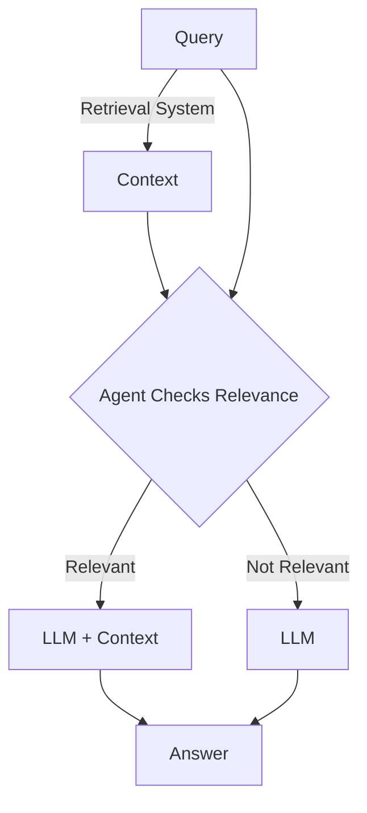
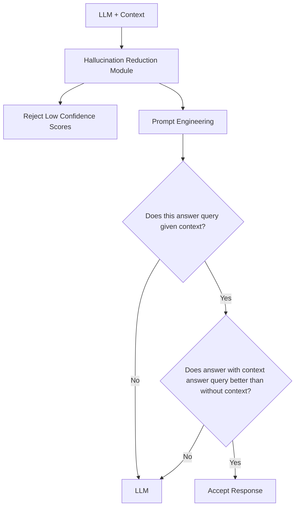

import ReactPlayer from 'react-player'
import ArchitectureDiagram from './architecture-diagram.svg';

## Introduction

It has been a while since I last shared my thoughts on designing and building an Agentic RAG system in my previous [Medium Blog](https://medium.com/@gohn0004/agentic-rag-36d38b20fb1f). In this post, I aim to first discuss the inspiration behind building the system and then delve into the challenges I encountered, along with potential future hurdles.

## Inspiration

### The Role of RAG

Consider the following question:

> **Question:** What is a famous Taylor Swift song?

:::info[common knowledge]

Cruel Summer

:::

A domain expert is not needed for the above question as the average person can answer this.

Now, consider the next question:

> **Question:** What are the symptoms of bipolar?

:::info[domain expert]

<details>

  <summary>Expand Excerpt</summary>

**Diagnostic Criteria for Bipolar Disorder** *(Excerpt retrieved from a [clinical reference](https://repository.poltekkes-kaltim.ac.id/657/1/Diagnostic%20and%20statistical%20manual%20of%20mental%20disorders%20_%20DSM-5%20(%20PDFDrive.com%20).pdf))*

> **7**. Decreased need for sleep (feeling rested despite sleeping less than usual; to be contrasted with insomnia)

  > **A**. Mixed symptoms are observable by others and represent a change from the person’s usual behavior.

  > **B**. For individuals whose symptoms meet full criteria for either mania or hypomania, the diagnosis should be bipolar I or bipolar II disorder.

  > **C**. The mixed symptoms are not attributable to the physiological effects of a substance (e.g., a drug of abuse, a medication or other treatment).

> **Note**: Mixed features associated with a major depressive episode have been found to be a significant risk factor for the development of bipolar I or bipolar II disorder. As a result, it is clinically useful to note the presence of this specifier for treatment planning and monitoring of response to treatment.

</details>

Symptoms of bipolar disorder include episodes of mania, which may involve rapid speech, racing thoughts, distractibility, and decreased need for sleep. Additionally, individuals may experience depressive episodes characterized by feelings of sadness, hopelessness, and loss of interest in activities. Mixed features can also occur, where symptoms of both mania and depression are present simultaneously.

:::

The *average person* would not know the answer to the above question. Instead, this question is best answered by a **domain expert**.

Similarly, RAG is needed in some queries but not in others. However, should RAG be used in all queries?

### Is RAG the Right Solution for Everything?

Can RAG's retrieved contexts corrupt LLM's knowledge?

> **Question**: What are some effective strategies to improve sleep quality?

:::info[domain expert]

<details>

  <summary>Expand Excerpt</summary>

**Diagnostic Criteria for Bipolar Disorder** *(Excerpt retrieved from a [clinical reference](https://repository.poltekkes-kaltim.ac.id/657/1/Diagnostic%20and%20statistical%20manual%20of%20mental%20disorders%20_%20DSM-5%20(%20PDFDrive.com%20).pdf))*

> **7**. Decreased need for sleep (feeling rested despite sleeping less than usual; to be contrasted with insomnia)

  > **A**. Mixed symptoms are observable by others and represent a change from the person’s usual behavior.

  > **B**. For individuals whose symptoms meet full criteria for either mania or hypomania, the diagnosis should be bipolar I or bipolar II disorder.

  > **C**. The mixed symptoms are not attributable to the physiological effects of a substance (e.g., a drug of abuse, a medication or other treatment).

> **Note**: Mixed features associated with a major depressive episode have been found to be a significant risk factor for the development of bipolar I or bipolar II disorder. As a result, it is clinically useful to note the presence of this specifier for treatment planning and monitoring of response to treatment.

</details>

A decreased need for sleep is not necessarily problematic, as some individuals feel rested despite sleeping less than usual. However, if sleep disturbances are accompanied by changes in mood or energy levels, it could be indicative of bipolar disorder. In such cases, it may be clinically useful to monitor symptoms and consider treatment options.

:::

Instead of giving tips on sleeping, such as *reducing screen time before bed* or *improving pillow quality*, the LLM's completion can be **corrupted** to a *bipolar disorder bias*.

How can I dynamically route questions between a RAG-powered domain expert and a vanilla LLM for general knowledge?

### The Importance of Orchestration



> **Relevance Prompt:** Given the following context and a chat history with the latest user question, decide if the context is relevant or not. Do not guess. If you do not know, say no. Reply only yes or no. \{context\} \{history\} \{query\}

:::tip

This is a straightforward routing problem, so a simple prompt will do.

For a more complex case that requires advanced prompts and workflows, check out [this blog](/blog/etl-automation).

:::

While multiple approaches exist, this application aims to minimize complexity while maintaining effectiveness, aligning with Occam’s Razor. The future sections will discuss potential optimizations, trade-offs, and metrics for evaluating success.

## Demo

Feel free to check out the demo [here](/ui) before I dive into the challenges, technical details, and implementations!

<ReactPlayer playing controls url='/vid/agentic-rag/agentic-rag.MOV' />

## Challenges Encountered

### Production Challenges in an Agentic RAG System

:::warning

Agents = LLM + Tool?

RAG = LLM + Vectorstore?

:::

Agents and RAG are easy to grasp conceptually but offer eye-opening insights when implemented in production.

Despite passing tests for correctly orchestrating RAG, then correctly retrieving relevant contexts in development, I faced a few issues in production.

The agentic workflow for determining if RAG is needed occasionally made incorrect choices for certain user queries. Some edge cases were overlooked during development, either due to human error or the inherent difficulty of anticipating all scenarios.

Additionally, some retrieved RAG contexts were not helpful in answering queries exposed mismatches—chunks were sometimes too small for broad queries and too large for highly specific ones.

Perhaps these can be mitigated after further examining the following section.

## Challenges in Refining a RAG System

### Mitigating Hallucinations

This flowchart outlines a possible Hallucination Reduction Module, which explores rejecting low-confidence outputs and using prompt engineering to assess response accuracy and relevance.



### Breaking Down RAG Component Challenges

RAG comprises of many components, listed as subsections in this section.

Each of these components can be optimized, with improvements—and unfortunately, _errors_—propagating to subsequent stages.

This raises a crucial question, answered in the next section: **How can I measure and evaluate RAG performance?**

#### Document Type Ingestion

| **File Type** | **Challenges** | **Required Handling** |
|-------------|--------------|------------------|
| **PDF** | Varying structures (scanned, OCR, embedded text) | Specialized PDF parsers (e.g., PyMuPDF, pdfplumber, Tesseract for OCR) |
| **HTML** | Presence of scripts, ads, and formatting inconsistencies | HTML parsing and cleaning (e.g., BeautifulSoup, trafilatura) |
| **Word Docs (DOCX)** | Embedded images, tables, and complex formatting | DOCX-specific parsers (e.g., python-docx) |
| **Plain Text** | Lack of structure, possible encoding issues | Minimal processing but may require cleaning and normalization |

#### Chunking Strategy

| **Chunk Size**  | **Pros** | **Cons** | **Use Case** |
|----------------|---------|---------|-------------|
| **Large Chunks** | Retains broader context for answering comprehensive or multi-hop queries | May introduce irrelevant information, increasing LLM confusion | *"What are the legal obligations under Section 12?"* (May require referencing multiple sections) |
| **Small Chunks** | Provides precise and relevant information for focused queries | Lacks surrounding context, potentially missing key details | *"What is the refund policy for digital products?"* (Specific, direct retrieval) |

#### Embedding and Response Model

| **Model**   | **Pros**                                      | **Cons**                                       | **Best For**                |
|----------------------|----------------------------------------------|----------------------------------------------|----------------------------|
| **Domain-Specific**  | Captures nuances in fields like law & medicine | Costly to develop and maintain                | Specialized applications   |
| **Generic**         | Easy to update and maintain                    | May underperform in niche domains             | Broad, multi-domain tasks  |

#### Retriever Strategy

| **Retriever Strategy**  | **Pros** | **Cons** | **Use Case** |
|------------------------|---------|---------|-------------|
| **Keyword Search (BM25, TF-IDF)** | Fast and precise for exact terms | Misses semantic matches | Legal or regulatory text search |
| **Dense Vector Search** (dot product, cosine similarly, etc...) | Captures semantic meaning | May retrieve irrelevant results | General RAG with natural language queries |
| **Re-Ranker** | Improves relevance of retrieved results | Slower and more compute-heavy | High-precision search (legal, medical) |

### RAG Evaluation

Should RAG be evaluated end to end naively with accuracy as the metric? If the [retrieved context is wrong but the response generated from this context is correct](#is-rag-the-right-solution-for-everything), should the metric reflect this or simply label the answer as wrong.

How can context and response generation be evaluated separately?

[Ragas](https://docs.ragas.io/en/latest/concepts/metrics/available_metrics/#retrieval-augmented-generation) provides a list of metrics.

## Medium Blog

As mentioned, this post builds upon my previous Medium blog, which you can find [here](https://medium.com/@gohn0004/agentic-rag-36d38b20fb1f) or read below for your convenience.

<ArchitectureDiagram />

### Cloud Deployment

#### Deploying with BentoML

After reading about deploying Agents with BentoML’s FAAS, I started my own experiment with a simple function utilizing OpenAI’s GPT 4. BentoML’s Infrastructure as Code (IaC) allowed me to set up compute resources, scaling, and containerization almost effortlessly, quickly providing me with callable API endpoints. While effective, the daily cost of approximately SGD 1.5, for a personal project, led me to explore more budget-friendly options.

#### Transitioning to AWS

AWS presented a more affordable path, but as a newcomer to the platform, I had to make some System Architectue choices. Do I use Lambda as my API Endpoints and Amplify to deploy my UI or should I deploy everything on an EC2 Instance? Here’s what I considered.

##### Option 1—Lambda + Amplify

This approach required a microservice architecture where the UI and API were loosely coupled. Testing both cloud-only components together would add time to my development process, so I opted to avoid the added complexity of managing a distributed system at this stage.

##### Option 2—EC2

With Docker Compose and EC2, I could easily develop, test, and debug both locally and on the server. This unified approach reduced setup complexities and kept my infrastructure manageable.

### Backend: Framework and Feature Selection

#### RAG Framework

There are many frameworks to do RAG: Llamaindex, Langchain, Korvus to name a few. Llamaindex is a niche RAG framework while Langchain is a larger toolkit capable of many extra bells and whistles that I do not require for this project.

##### Event Streaming

Llamaindex supports streaming responses, which is a must have. This allows streaming the completions from API to UI in real time as opposed to waiting for everything to be generated before sending it over. But what if I want intermediate steps taken by Llamaindex, for example, seeing the final prompt sent to OpenAI or the relevant contexts retrieved before the generation in RAG? Langchain makes this easier with Event Streaming. Events are easily accessed with:

```text
on_retriever_stream
on_chat_model_stream
on_prompt_stream
```

##### Agent Orchestration

Both Llamaindex and Langchain have agent capabilities but dictating the flow between (if any) LLM, custom tool and other LLMs is hacky at best. What if I want a hierarchy? A supervisor agent delegating tasks to worker agents to execute. What if I want this agent to always call a custom tool? Langgraph immediately comes to mind as Agent Orchestration is exposed as a graph for a lot of control. Again, integration with Langchain is made easier with event stream as compared to Llamindex.

##### Langchain vs Korvus

Korvus allows RAG to be done at the SQL level via PostgresML. This greatly reduces the codebase I have to develop and maintain; I don’t have to construct Langchain chunkers, vectorizers and retrievers, and can simply specify a configuration for Korvus to manage the chunking and vectorizing stages in addition to the retrieval stage. Furthermore, PostgresML supports cloud and self hosted deployments. However, due to event streaming and the fact that I haven’t caught up with newer versions of Langchain in awhile, I decide to catchup and use Langchain.

#### Agentic RAG

For this project, I decided to fix ingestion to just one document. DSM 5 is a large 992 page document describing many disorders and the diagnostic criteria among other things. How can I ascertain if the user query should be answered with contexts retrieved from this document? Do I simply check if the query is related to any form of disorder or diagnostic criteria? Can the contents of 992 pages be condensed into the previous sentence?

Instead, I decided to retrieve relevant contexts for any query. From here, I delegate the decision to an agent: are these contexts relevant to the query, given the current chat history? As this agent orchestration is minimal I was able to keep things simple with Langchain’s chaining instead of using Langgraph’s more powerful orchestration at the cost of complexity. As detailed in the diagram, if the contexts are relevant, they are used in the generation part of RAG. If not, a normal LLM call is made with the system prompt, user query and chat history if any instead. This call would then be identical to endpoint:

```text
/completions
```

#### Database

I needed to store metadata and vectors.

##### Metadata

I wanted DB transactions to be ACID so I chose the well known Postgres to help enforce this.

##### Vectorstore

At the time, I wasn’t sure how big a document I would settle with, nor the number of embeddings i would end up with. Milvus caught my eye as it can cater to at least a few million vectors and seemed to be the go to vectorstore. As it turned out, this didn’t matter as I ended up with a little under 5k vectors.

##### Cross DB Consistency

However, the larger problem was ensuring vectors were inserted when metadata was inserted. Suppose a vector insertion into Milvus fails, I would need to implement checks and rollbacks to rollback metadata insertion into Postgres increasing my development time. As such, I decided to have all my data together in PGVector where easier rollbacks can be done.

#### Scalability

This is a personal project that I probably won’t spend time scaling. However, suppose I did, the first thing to fail at scale would probably be my API. LLM completions are streamed to UI with FastAPI’s asynchronous functions. This can potentially block the whole API’s event loop due Python and its GIL. Increasing Uvicorn workers could help solve this issue.

#### Ingestion

To keep EC2 costs low, I chose the smallest CPU. This meant I had to carefully design how to handle loading, chunking and vectorizing pages to reduce RAM usage. After experimentation, I found I could smoothly preprocess the PDF 50 pages at a time. However, this means I lose a potentially relevant chunk of context, perhaps the last line of page 50 and the beginning line of page 51. To combat this, I process the PDF 50 pages at a time, with a rolling window of 49. This ensures the chunk between page 50 and 51 is not lost, with the small tradeoff of very similar chunks on page 50 as it is chunked twice.

#### Terraform IaC

I didn’t want to manually click the console to provision resources as I would forget what to click, but more importantly, running code is faster and more reproducible than clicking to provision resources. I configured Terraform configs to:

- provision EC2, pinning ubuntu image
- ingress egress security policies to and fro EC2
- elastic IP for static IP address to point my domain to
- provision ECR
- image deletion policies for old images on ECR to save costs
- access policies to ECR
- build, tag my deployment containers then push them to ECR
- With the above, I can easily destroy all resources should I chose to, where manually doing so might result in me forgetting to destroy something, incurring unwanted costs.

### UI

I didn’t want to spend time developing my UI from scratch so I found this open source UI and forked it. There were still 2 major things I had to do: Authentication and API integration.

#### Clerk Authentication

I found Clerk to be an easy way to add authentication to my UI. It greatly removed parts of my development time as I didn’t need to implement any login/logout components, nor worry about implementing authentication from scratch. With the user id provided by Clerk, I am able to store user specific queries and chat history for multi user experience.

#### API Integration

I stopped UI from handling OpenAI API calls as I wanted my API to handle it. Most AI frameworks, mature or cutting edge, tend to be written in Python so further work is made easier by porting calls from UI to API. I wanted UI to fetch data from API as API is connected to my DB, instead of storing and retrieving data on the client side with vanilla localstorage in typescript. Furthermore, I wanted UI to accept Server Sent Events (SSE) via EventSource instead of decoding a POST to API with TextDecoder. I decided on SSE over Websockets (WS) as I only needed one way communication and SSE implementation required less boilerplate in API, for better maintainability. In addition, I removed some functionalities to make things simpler, such as selection of current and previous conversations and exposing the choosing of prompts.

### Possible Future Work

#### RAG Improvements

Each component of RAG can be improved. Better embedding model, more chunking with the tradeoff of too similar/redundant chunks, better LLM model. In addition, I did not incorporate a reranker to prioritize relevant contexts retrieved before generation.

#### On Premise

I understand that RAG might be required to run offline for sensitive documents. I have no plans to carry this out for this personal project, but I am aware of the steps to be taken. I can swap out the embedding and completion models from text-embedding-3-small and gpt-4o-mini to respective local models such as hkunlp/instructor-large and llama-3–70b-instruct. Before doing so, I would need to check if the literature supports the efficacy of these models. Important questions would be what is the task to be solved, so the metric to validate efficacy can be chosen.

#### Terraform

I have not configured terraform to provision status checks and alarms, though I have configured them manually to alert me when my application is down. Furthermore, I still have much to learn such as creation and management of accounts and access policies for the respective accounts.

#### Refactor UI

Currently, most of the logic is in a single large file. It is time to pay off technical debt and refactor into bite-sized components for easier future development and maintenance. Instead of passing props through many layers of nested components, I can consider using a state management solution like Zustand. However, I will need to weigh the tradeoff of having some boilerplate code for the state management.

### Conclusion

Working on this project was both engaging and insightful. It allowed me to leverage my existing knowledge, while also uncovering new concepts and filling in knowledge gaps I hadn’t anticipated.
