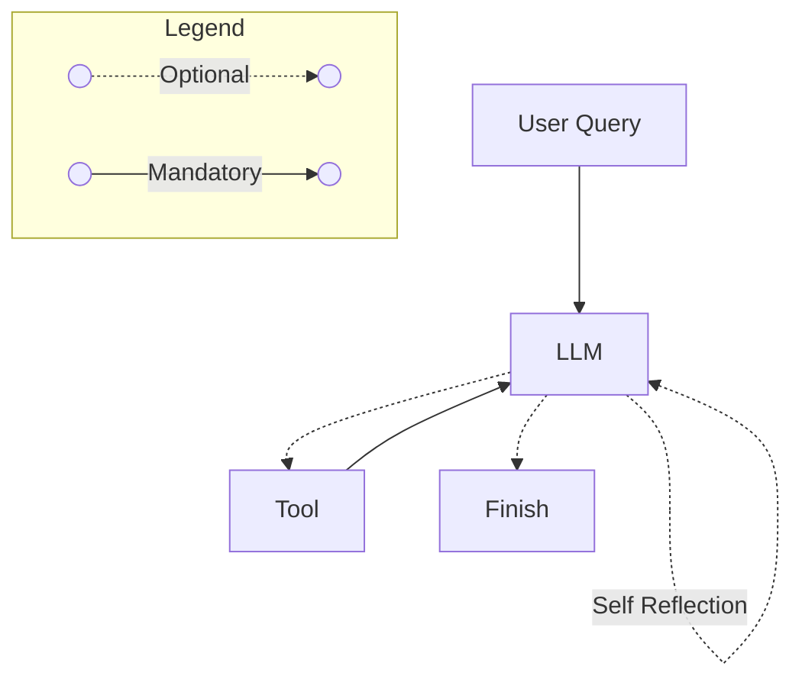
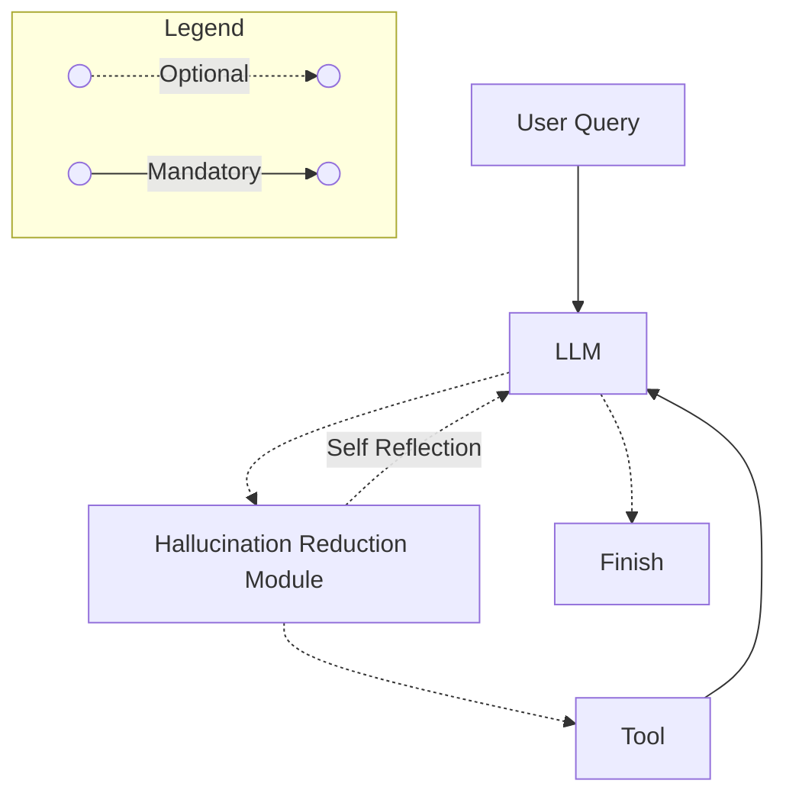

import ReactPlayer from 'react-player'

## Introduction

In this blog, I explore how automation simplifies problem-solving by testing AI’s ability to break tasks into subproblems. This use case worked with a single agent, but more complex problems require multi-agent orchestration—covered in the [next blog](/blog/customer-service-automation).

<!-- truncate -->

## AI’s Business Impact: Aligning Technology with Strategy

Data ingestion is often a bottleneck for businesses dealing with multiple service providers. The challenge isn't just handling large volumes of data—it’s managing provider-specific schemas, adapting to schema changes, and maintaining consistency across updates. Manually handling these variations is tedious, error-prone, and difficult to scale.

AI-powered automation can help mitigate these challenges by:

- Assisting with schema adaptation when providers update their formats.
- Reducing operational overhead, allowing teams to focus on higher-value tasks.
- Improving efficiency and minimizing downtime caused by schema mismatches.
- Supporting more reliable decision-making with structured, up-to-date data ingestion.

However, AI is not a silver bullet. Risks like hallucinated transformations or misinterpretations of schema changes require robust safeguards. Detailed logging and iterative improvements help detect issues, refine workflows, and adapt the system over time.

For businesses looking to scale, balancing automation with oversight is key. Tracking queries, intermediate steps, and outputs can help to detect errors and patterns. This can help improve the system over time.

### The Importance of Orchestration

LLMs generate text but cannot execute code. To incorporate execution, they must delegate tasks to external tools and refine responses based on the results. The diagram below illustrates this orchestration. Can this be achieved using prebuilt solutions, or does it require a custom implementation?



## Demo

Check out the [demo](/use-cases/etl-automation/ui) before we explore the challenges, technical details, and key insights.

<ReactPlayer playing controls url='/vid/agentic-rag/etl-automation.MOV' />

## Navigating Trade-offs in AI System Design

### Prebuilt Agent

Langchain provides a [prebuilt](https://github.com/langchain-ai/langchain-experimental/blob/libs/experimental/v0.3.4/libs/experimental/langchain_experimental/agents/agent_toolkits/pandas/base.py#L152) CSV Agent. At first glance, it seems to solve the problem of orchestration for me, however, on closer inspection, there are some concerns.

#### Pros

| Feature                              | Description                                                |
|--------------------------------------|------------------------------------------------------------|
| **Ease of Use**                      | Works out of the box with minimal setup                    |
| **Streaming Events**                 | Supports real-time streaming with intermediate thoughts and actions |
| **Observability**                    | Built-in event streaming makes reasoning process transparent |
| **Orchestration**                    | Manages tool selection, execution, and self-reflection in a loop until a final response is generated |
| **Mental Load**                      | Frees up cognitive effort to focus on high-level problem solving |
| **Quick Deployment**                 | Requires minimal configuration, enabling rapid prototyping |

:::info[Example Streamed Event]

```python
AgentAction(
  tool='python_repl_ast',
  tool_input="df[(df['Event Details'].str.contains('09-08-2018')) & (df['Frequency'] == 'Recurring')]",
  log='Thought: I need to check if there are any monthly bookings on 9 August 2018 in the dataframe. I will filter the dataframe for entries with the date "09-08-2018" and a frequency of "Recurring". Then, I will extract the relevant details for any such bookings.\n\nAction: python_repl_ast\nAction Input: df[(df[\'Event Details\'].str.contains(\'09-08-2018\')) & (df[\'Frequency\'] == \'Recurring\')] '
  observation='''
    Customer Invoice No.,Event Details,Link Event,Customer Name,Provider Name,Frequency,Hourly Rate,Duration,Amount Gross,Amendments,Gross Difference,Unnamed: 11
    1b1c9f58-bd91-4289-929f-948e718e2473,04-08-2018 09:30,link,Alice Ng,SparkleClean Services,Cancellation,22.5,2.5,0.0,Yes,-66.25,
    ...
    '''
)
```

As seen above, prebuilt agent will:

- handle [the orchestration](#the-importance-of-orchestration)
- streamed events that can be transmitted to the frontend using a preferred server-client communication method (e.g., WebSockets, Server-Sent Events)
  - this enables real-time rendering of the agent's thought process, enhancing transparency and user experience.

:::

#### Cons

| Feature                              | Description                                                |
|--------------------------------------|------------------------------------------------------------|
| **Limited Flexibility**               | Predefined agents exist (e.g., Pandas Dataframe Agent), but lacks support for problems that requires specialized agents |
| **Restricted Orchestration Between Agents** | Difficult to implement complex multi-agent workflows when the problem demands specialized coordination |

For this blog, the Pandas DataFrame Agent is well-suited for the ETL use case, making LangChain’s prebuilt solution a practical choice. The problem scope does not require multi-agent coordination, so the limitations in orchestration are not a concern here. However, I will still explore an alternative that offers greater flexibility in designing custom agent interactions: LangGraph.

### Alternative: Langgraph

Langgraph presents a compelling alternative when the use case demands greater flexibility in orchestrating multiple agents. Unlike Langchain’s predefined agents, Langgraph allows for customizable workflows, enabling multi-agent collaboration, conditional logic, and more complex decision-making.

#### **Pros**

| Feature                              | Description                                                |
|--------------------------------------|------------------------------------------------------------|
| **Flexible Orchestration**           | Allows for complex agent workflows, including multi-agent interactions, conditional branching, and asynchronous execution. |
| **Fine-Grained Control**             | Developers can define precise execution logic, ensuring that agents interact optimally based on the use case’s needs. |
| **Extensibility**                    | Provides a modular foundation to scale and integrate with other AI components as requirements evolve. |

#### **Cons**

| Feature                              | Description                                                |
|--------------------------------------|------------------------------------------------------------|
| **Increased Complexity**             | Greater customization comes with a steeper learning curve and higher development effort compared to Langchain’s prebuilt agents. |
| **Manual Implementation Required**   | Orchestration has to be manually implemented as opposed to the prebuilt one in Langchain. |

While Langchain’s predefined agents are sufficient for this ETL use case, exploring Langgraph lays the groundwork for the [next blog](/blog/customer-service-automation), where the problem scope justifies the need for a more advanced, multi-agent orchestration approach. Given this, I ultimately chose to implement Langgraph for this blog.

## Scaling AI Systems: Architectural and Operational Insights

### Scaling Considerations for a Small User Base

The initial goal is to support tens of users effectively while ensuring a balance between performance and cost-efficiency. Right out of the box, the OpenAI API and FastAPI as the backend handle concurrency efficiently, reducing the need for additional scaling efforts in the early stages.

### Exploring Groq for Fast Agentic Workflows

Groq presents an alternative cloud provider for LLMs, particularly excelling in agentic workflows requiring rapid responses. Key observations:

- It delivers significantly faster inference times, enhancing user experience.
- From my experience, it tends to be more talkative but less effective at solving tasks compared to GPT-4O-Mini.
- The cost is approximately six times higher than mainstream alternatives.
- Given the above trade-offs, I did not invest heavily in prompt engineering, as the core focus of this blog is not on achieving low latency.

Choosing the right LLM cloud provider with my current goal in mind is essential—treating this as a stepping stone rather than an endless pursuit of the "best" solution. There will always be "better" approaches for different use cases, but without a clear stopping point, I risk constantly iterating without making real progress.

## Failure Analysis: Debugging and Mitigating AI Pitfalls

### The Interplay Between Prompts and Models

Given the scaling experiment [above](#scaling-considerations-for-a-small-user-base), I noticed that prompt-model tagging will be necessary should I continue on the path of different models in production. As each model is trained differently, prompts are model-specific and should be tagged to each model for best results.

### The Importance of a Hallucination Detection Module



In hindsight, integrating a hallucination detection module is crucial, even if it does not entirely prevent incorrect outputs. It provides an additional layer of reasoning and debugging, helping to:

- Detect inconsistencies in model-generated responses before Python pandas code is executed
- Reduces the risk of propagating erroneous outputs.

However, implementing such a module increases system complexity. Given this, I hope to cover better orchestration strategies in a separate blog.

## Security Risks and Best Practices in AI Systems

Using a prebuilt pandas DataFrame agent introduces security risks by exposing system Python execution to anyone accessing the system. In a production environment, this can have serious implications:

- **Containerized Deployment on AWS**
  - The production environment runs in AWS-managed containers.
  - Containers are ephemeral—if the environment is corrupted, they can be easily destroyed and redeployed.
  - They contain nothing of value other than the API key (discussed in the next section).
  - My personal desktop remains unaffected by these risks.

### API Key Exposure and Mitigation Strategies

- **Risk of OpenAI API Key Exposure**
  - The API key must be accessible on the production server to interact with GPT-4O-Mini.
  - While restricting API key exposure at the prompt level (e.g., preventing it from being output) may seem like a solution, it can be bypassed via jailbreak techniques.
  - To mitigate this, I have enforced security at the code level, ensuring the API key is never exposed in logs, responses, or accessible environments.
    - Additionally, I have implemented usage limits at the API provider level to cap monthly expenses, serving as a fail-safe in case of unexpected leaks or abuse.

- **Potential and Unknown Attack Vectors**
  - Despite implemented safeguards, I am aware of specific ways my API key could still be leaked.
  - Additionally, unknown vulnerabilities may exist, which need continuous assessment and mitigation.

### Long-Term Security Considerations

If this system is scaled further, securing the API key and the overall infrastructure must be a top priority. A more comprehensive approach—including environment isolation, access controls, and strict request validation—should be taken to minimize security risks.

## Lessons Learned from AI Deployments

Agentic workflows are just tools, not solutions—they require a clear use case or domain-specific challenge to be effective. Not every problem warrants an agentic approach; the complexity must justify the need for automation. Scalability and efficiency should be considered from the start, ensuring workflows remain adaptable through iterative improvements.
