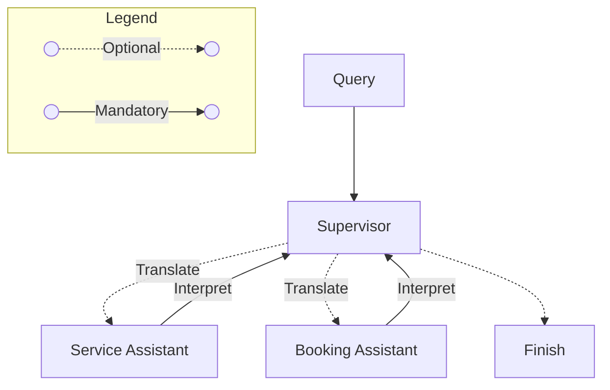
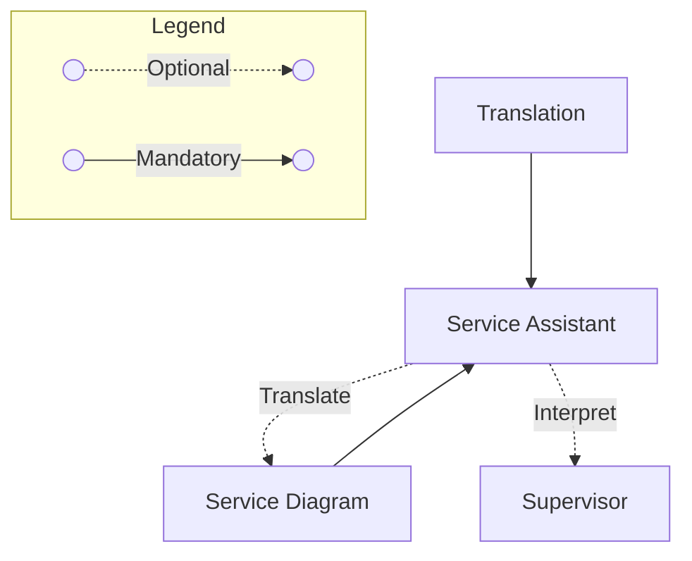
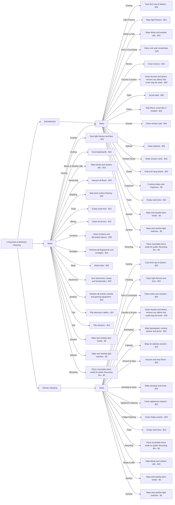
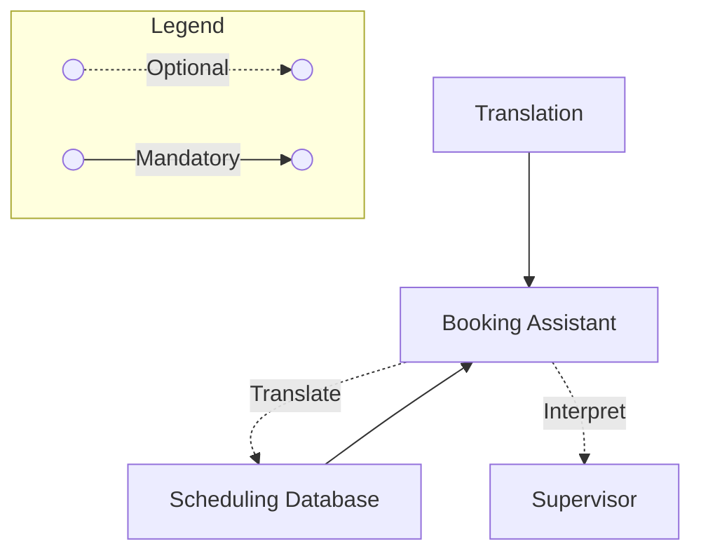

import ReactPlayer from 'react-player'

## Introduction

In this blog, I explore how a complex problem with moving parts can be solved, by having it broken down into smaller problems to be solved—automatically.

<!-- truncate -->

## AI’s Impact: Aligning Tech with Strategy

Following from previous blog, suppose the (manual, semi automatic or automatic) ingestion of data from multiple service providers is done. How can a system answer users' queries? First lets group some possible queries into categories.

| Query | Category |
|-------------------------------|------------------|
| Do you clean kitchen and cabinets? | Service |
| How much do you charge for cleaning toilets? | Service |
| Is Jan 20 available for booking at 9am? | Booking |

Of course, any combination of the above queries and alike can be asked by the customer, which brings about some questions:

- How do we decide which category a question belongs to?
- What if a question has multiple parts—how do we process them in the right order?
- Once we understand the question, how do we fetch and return the right information?

For example, if a user asks: "How much do you charge for cleaning toilets? Is Jan 20 available for booking at 9am?", the system needs to:
1. Recognize this is actually two separate queries—one about pricing and one about booking.
2. Process them in a way that makes sense (e.g., retrieve price then check availability).

Notice that queries thus far are phrase in perfect English—this is rarely how users phrase them. In reality, queries might be more fragmented or ambiguous. For example, someone might ask: "toilet how much and jan 20 9am can". See [demo](#demo) for more examples. I modeled how this could be done in reality.

## The Importance of Orchestration

### Supervisor

Similar to real life, a Supervisor would:

- break down complex tasks into smaller tasks for specialized assistants
- rewrite ambiguous queries into clearer requests (e.g., "toilet how much and jan 20 9am can" becomes "What is the price for cleaning a toilet?" and "Is Jan 20 available for booking at 9am?")

### Service Assistant

Having access to the possible cleaning services provided and the respective costs, the Service Assistant would:

- Reference the diagram to answer service related questions

:::warning[Huge Diagram]

  
Service Diagram

:::

### Booking Assistant

Having access to the booking system, the Booking Assistant would:

- Check if the requested time slot is available.
- Confirm whether the user wants to proceed with the booking if the slot is open.
- Notify the user if the slot is unavailable and suggest the next available time.

## Demo

Check out the [demo](https://nicholas-goh.com/use-cases/customer-service-automation/ui) before we explore the challenges, technical details, and key insights.

<ReactPlayer playing controls url='/vid/agentic-rag/customer-service-automation.MOV' />

## Design Choices

In the [previous blog](/blog/etl-automation), prebuilt LangChain agents handled most of the orchestration. However, this no longer applies since no existing prebuilt solution fully fits this use case. A custom approach is needed to orchestrate how the Service and Booking assistants work together.

A key consideration is deciding what logic belongs in prompts versus code:

- **Booking logic**: Overlapping bookings should be explicitly handled in code rather than inferred through prompts. This involves:
  - **SQL triggers** to detect conflicts when a pending booking is inserted.
  - **Structured error handling** to prevent hallucinations by ensuring the LLM has clear failure signals. For example:
    - *"The timeslot overlaps with an existing booking for worker %: conflicting booking from % to %. Next available time is %."* This allows the model to provide accurate responses instead of guessing.

- **Assistant selection**: Routing decisions are heuristic at best in code, so an LLM should determine the appropriate assistant. This involves:
  - **Supervisor setting execution order**, ensuring assistants act in the correct sequence.
  - **Supervisor restructuring queries**, converting user input into precise tasks for each assistant.

By handling failures explicitly at the code level, the system minimizes hallucinations, ensuring that assistants provide accurate and meaningful responses.

## Unit Testing

Unit testing is crucial for maintaining system reliability, especially in an agentic workflow where:

- Small prompt changes can alter agent outputs.
- These changes propagate to downstream agents, potentially affecting the entire system.

From my experience, traditional unit tests don’t always work well in this setup because:

- LLM outputs can still vary, even with the same input and temperature set to 0.
- Exact string matching is unreliable—tests should pass if expected and actual outputs are semantically equivalent.

### Solution: LLM-Based Testing

To address this, an LLM can evaluate test results based on meaning rather than exact wording. This ensures robustness while allowing for natural variations in language.

## Tracing: Observability and Monitoring

### Understanding the Flow of Requests with Langsmith

Langsmith provides a structured way to visualize the flow of a request, making it easier to debug and optimize AI agent interactions. By tracing execution paths, we can pinpoint issues such as:

- **Incorrect outputs**: If an agent produces the wrong response, the issue could stem from:
  - **Unclear instructions**: The prompt may need refinement to provide better guidance.
  - **Misaligned tool descriptions**: The selected tool may not match the query or task.
  - **Incorrect input from a previous step**: The agent might be receiving flawed information.
  - **Model limitations**: If none of the above apply, the agent may lack the necessary capacity, requiring a model upgrade.
- **High latency**: If an agent's trace is taking too long to respond, the delay could be caused by:
  - **Excessive looping**: By examining the trace of the agent, we can determine if the LLM is repeatedly generating responses. If so, breaking the task into smaller subtasks may improve efficiency.
  - **Consistently high latency**: This may indicate network delays or rate limiting.

Tracing helped me quickly diagnose issues, minimizing debugging time by enabling me to focus directly on areas that needed improvement.

### Real-World Examples

Here are the sample traces from the demo.

- [do u mop kitchen and cabinets](https://smith.langchain.com/public/7e8dd233-a875-48ec-a26c-6d5abab0d81e/r)
- [toilet how much and jan 20 9am available?](https://smith.langchain.com/public/b5221550-842c-4814-bbd1-952aeef47497/r)
- [jan 20 12pm can](https://smith.langchain.com/public/1b413373-1d00-4985-8c98-1d5f456c967f/r)
