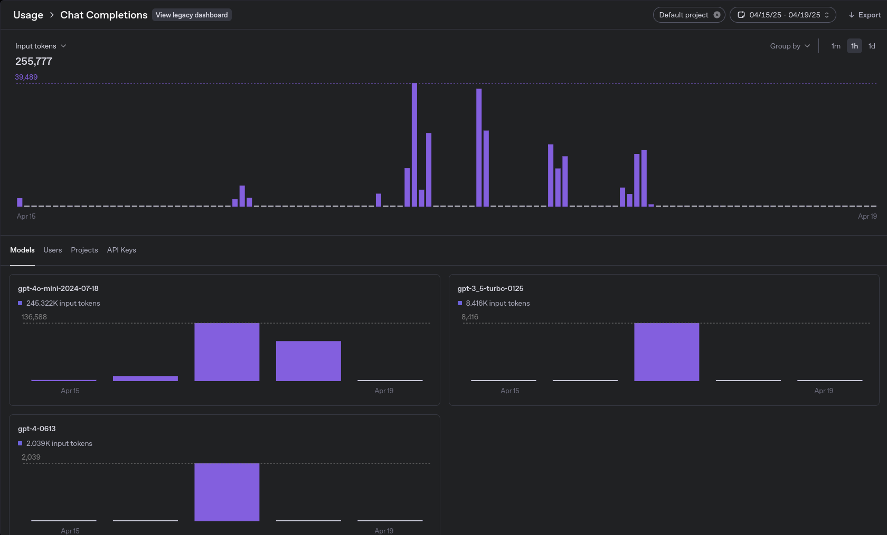
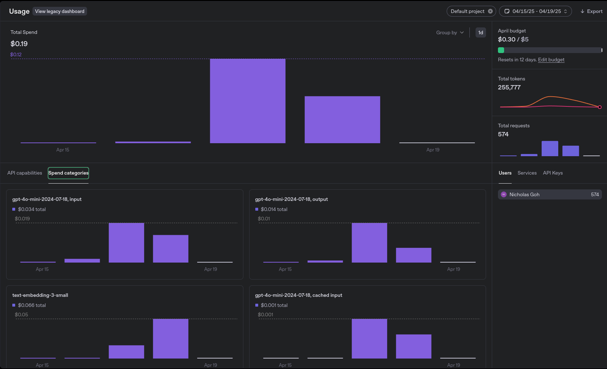
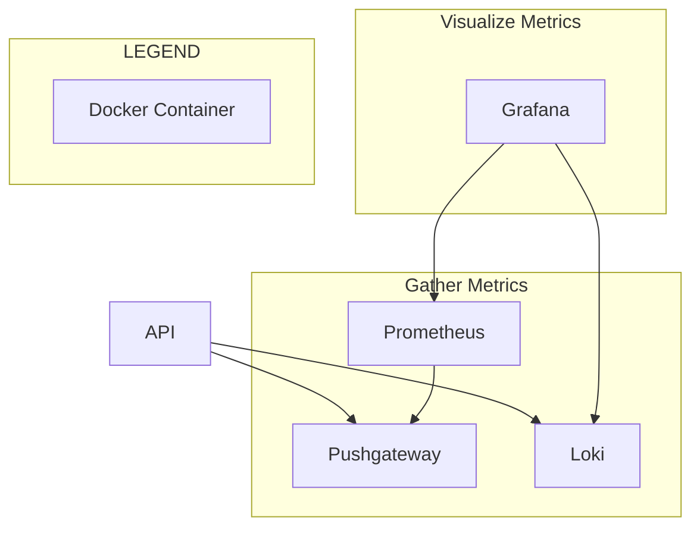

import ReactPlayer from 'react-player'

## Demo

Check out the following interactive dashboards, [Grafana](https://nicholas-goh.com/grafana) and [Langfuse](https://nicholas-goh.com/langfuse), before I dive into the blog!

 Username and password:

- `demo@demo.com`

### Grafana

<ReactPlayer playing controls url='/vid/monitoring-and-observability/grafana.mp4' />

<!-- truncate -->

### Langfuse

<ReactPlayer playing controls url='/vid/monitoring-and-observability/langfuse.mp4' />

## Introduction

In this blog, I dive deeper into the tools I found particularly useful while developing a [complex agentic system](/blog/customer-service-automation). Previously, I only touched on this topic briefly, sharing static snapshots of the technologies involved due to limitations in showcasing public-facing interactive dashboards. This blog offers solutions to that challenge.

## Monitoring: Enhancing Cost Tracking with Latency Metrics

### Native Monitoring with OpenAI: Token Usage and Cost

OpenAI provides a built-in dashboard for monitoring token usage, which offers the following benefits:

- **Minimal setup** — simply provide an API key.
- **Filterable analytics** — view usage by model and date.
- **Clear breakdowns** — number of requests, prompt and completion tokens, and cost per model.

#### Token Usage Dashboard

#### Cost Usage Dashboard

While the built-in monitoring is great for tracking usage and cost, it doesn’t surface latency metrics for individual requests — something I’ve found increasingly important to capture elsewhere.

:::tip[Latency Tracking in Context]

It probably makes more sense to handle latency tracking within the development and production environment, since that naturally includes not just model inference time but also network overhead, retries, and any local delays. This gives a more realistic picture of end-to-end performance as experienced by users.

:::

This lack of latency visibility becomes a limitation in more **complex agentic systems**, where understanding bottlenecks across chains of reasoning or worker nodes is key. For example:

- Is the delay in the supervisor node?
- Is a database tool or tool-use step slowing things down?
- Am I spending time waiting on slow responses from specific models?

I’m not planning to switch cloud LLM providers, but I want to stay flexible. Relying solely on OpenAI’s dashboards introduces a kind of **vendor lock-in** in monitoring visibility and granularity.

### Migrating to Grafana: Adding Latency and Flexibility

Grafana's [monitoring repository](https://github.com/grafana/grafana-openai-monitoring) provides and out of the box way to monitor usage and latency metrics. However, it only supports Grafana Cloud which defeats the purpose of not having a public-facing interactive dashboard.

:::note[Public Dashboard Limitations]

Although externally shared dashboards are possible, they are [limited](https://grafana.com/docs/grafana/latest/dashboards/share-dashboards-panels/shared-dashboards/#limitations). As such, I self hosted Grafana stack as follows:

  
Grafana Stack

:::

#### Adapting for Streaming Completions

Grafana’s example setup does not support streaming completions natively. I made the following changes to accommodate that:

##### Challenges with Prometheus

| Issue             | Description                                                                |
|-------------------|----------------------------------------------------------------------------|
| Short-lived jobs  | Prometheus is designed to scrape metrics from long-lived jobs like `/metrics` endpoints. |
| Incompatibility   | Streaming completions are short-lived and not easily integrated with the Prometheus Python client. |

#### Solutions Implemented

- Pushgateway Integration
  - Enables support for short-lived jobs.
  - Each completion (after the full stream ends) pushes usage metrics to Pushgateway.
  - Prometheus scrapes metrics from Pushgateway instead of directly from the short-lived job.
- Streaming Behavior
  - Metrics are not pushed per token, but only once per full completion.
  - This reduces metric noise and keeps the tracking efficient.
- Loki for Completion Logs
  - Completion events are logged into Loki.
  - This provides visibility into individual requests, helpful for debugging and tracing.
- Grafana Dashboards
  - Visualizes both usage metrics (from Prometheus) and event logs (from Loki).
  - Enables monitoring of latency, request volume, and real-time logs in one interface.

See below for the same demo video as [above](#demo).

#### Grafana Demo

<ReactPlayer playing controls url='/vid/monitoring-and-observability/grafana.mp4' />

 

The Loki logs demoed at the end of the video provide a concise overview of input, output, and the project environment. However, I found that I need more observability into what's happening between input and output. Specifically, I should be able to see the internal routing, such as how the supervisor receives the prompt, delegates it to workers, and how they solve it using tools if needed.

## Tracing: LLM Observability

### Langsmith: Dynamic Tracing, Static Public Sharing

I previously used Langsmith due to its minimal setup, which only requires an API key.

The native dashboard provides valuable features, including:

- Tracing each LLM call.
- Maintaining a node hierarchy, making it clear what each supervisor or worker receives as input and output.
- Displaying the latency and cost of each node.

These features significantly aided my development and debugging process by:

- Helping me pinpoint where prompt engineering issues occurred.
- Identifying potential optimizations for nodes and prompts to reduce processing time.

#### Langsmith Demo

<ReactPlayer playing controls url='/vid/monitoring-and-observability/langsmith.mp4' />

 

As previously mentioned, Langsmith does not offer a public-facing interactive dashboard. In earlier blog posts, I shared static snapshots of traces as a workaround. Below, I explore one solution for exposing a public-facing interactive dashboard to enhance observability.

### Langfuse: Dynamic Tracing with Public Dashboard

**Langfuse offers many features similar to Langsmith, with several additional enhancements:**

**Interactive flow diagram**:
  - Visualizes the execution flow between nodes, making it easier to understand complex call chains at a glance.

**Clickable nodes**:
  - Each node in the diagram is interactive—clicking on one navigates to its position in the node hierarchy.

**Detailed node insights**:
  - Upon selecting a node, Langfuse provides detailed information such as:
    - Inputs and outputs
    - Execution latency and associated cost

Furthermore, I can expose a public-facing interactive dashboard via a demo account.

#### Langfuse Demo

<ReactPlayer playing controls url='/vid/monitoring-and-observability/langfuse.mp4' />
