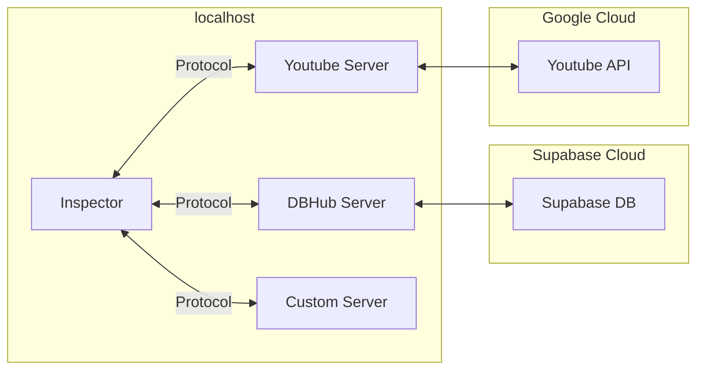
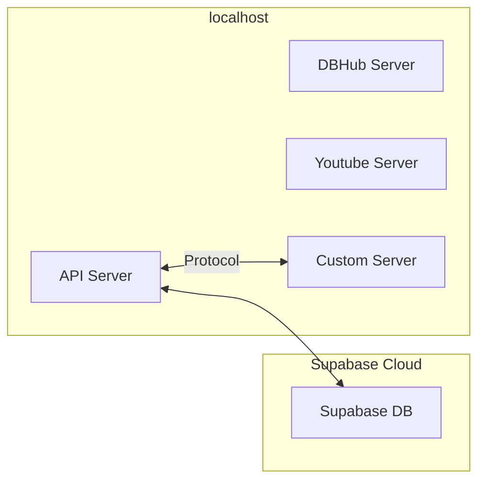
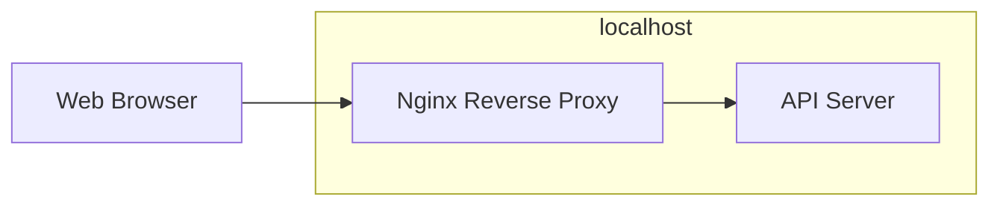
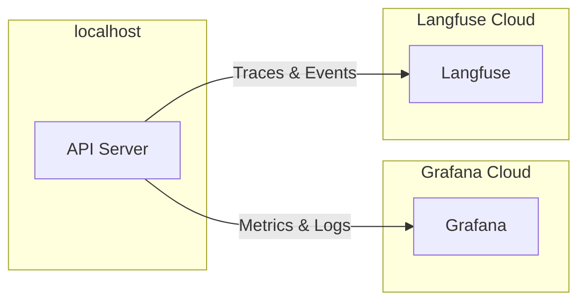

# Architecture

This section outlines the architecture of the services, their interactions, and planned features.

## Inspector

Inspector communicates via SSE protocol with each MCP Server, while each server adheres to MCP specification.

## Template Setup

The current template does not connect to all MCP servers. Additionally, the API server communicates with the database using a SQL ORM.

## Reverse Proxy

Can be extended for other services like Frontend and/or certain backend services self-hosted instead of on cloud (e.g., Langfuse).

## Planned Features

### Monitoring and Observability

### Authentication and Authorization

[Auth0 Source](https://auth0.com/docs/get-started/authentication-and-authorization-flow/authorization-code-flow)
